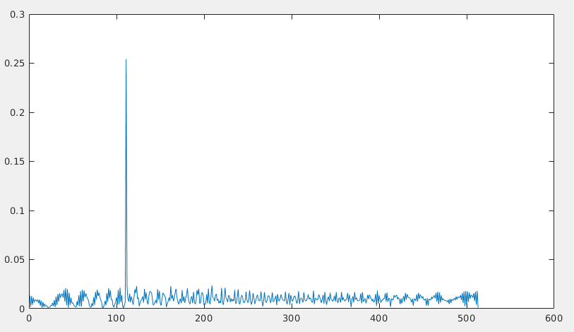
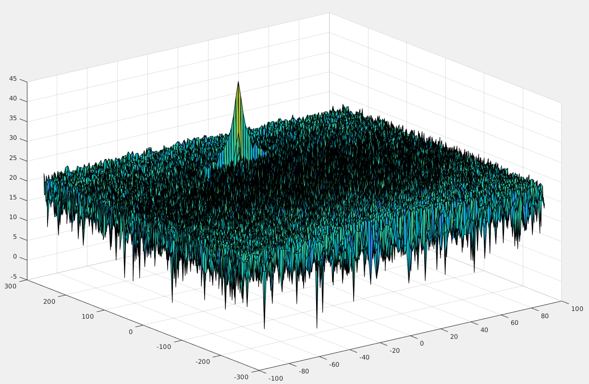
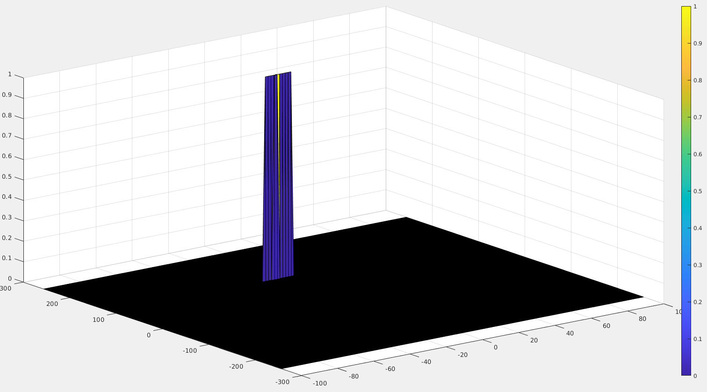

# SNFD Radar Target Generation and Detection

This project is about radar target generation and detection. 
Project goals are:
 * Configure the FMCW waveform based on the system requirements.
 * Define the range and velocity of target and simulate its displacement.
 * For the same simulation loop process the transmit and receive signal to determine the beat signal
 * Perform Range FFT on the received signal to determine the Range
 * Towards the end, perform the CFAR processing on the output of 2nd FFT to display the target.
 ```

 ```
---

## Project Layout


```

```
---  

## Project Specification

Sections from the project rubric. 

---
### FMCW Waveform Design
**Criteria**: Using the given system requirements, design a FMCW waveform. Find its Bandwidth (B), chirp time (Tchirp) and slope of the chirp. \
**Specification**: For given system requirements the calculated slope should be around 2e13.
```
%% FMCW Waveform Generation

% *%TODO* :
%Design the FMCW waveform by giving the specs of each of its parameters.
% Calculate the Bandwidth (B), Chirp Time (Tchirp) and Slope (slope) of the FMCW
% chirp using the requirements above.

B = c/2*range_resolution;
Tchirp = 5.5*(range_max*2/c);
slope = B/Tchirp;
```
---
### Simulation Loop
**Criteria**: Simulate Target movement and calculate the beat or mixed signal for every timestamp. \
**Specification**: A beat signal should be generated such that once range FFT implemented, it gives the correct range i.e the initial position of target assigned with an error margin of +/- 10 meters. 
```
for i=1:length(t)         

    % *%TODO* :
    %For each time stamp update the Range of the Target for constant velocity. 
    r_t(i) = Initial_range + Velocity*t(i);
    td(i) = 2 * r_t(i)/c;
    
    % *%TODO* :
    %For each time sample we need update the transmitted and
    %received signal. 
    Tx(i) = cos(2*pi*(fc*t(i) + slope*t(i)^2/2));
    Rx(i) = cos(2*pi*(fc*(t(i)-td(i)) + slope*(t(i)-td(i))^2/2));
    
    % *%TODO* :
    %Now by mixing the Transmit and Receive generate the beat signal
    %This is done by element wise matrix multiplication of Transmit and
    %Receiver Signal
    Mix(i) = Tx(i) * Rx(i);
    
end
```
---
### Range FFT (1st FFT)
**Criteria**: Implement the Range FFT on the Beat or Mixed Signal and plot the result. \
**Specification**: A correct implementation should generate a peak at the correct range, i.e the
initial position of target assigned with an error margin of +/- 10 meters. \

Implementation and ploting the resulting signal.
```
%reshape the vector into Nr*Nd array. Nr and Nd here would also define the size of
%Range and Doppler FFT respectively.
Mix=reshape(Mix,[Nr,Nd]);

 % *%TODO* :
%run the FFT on the beat signal along the range bins dimension (Nr) and
%normalize.
fft1_sig = fft(Mix, Nr);
fft1_sig = fft1_sig./Nr;

 % *%TODO* :
% Take the absolute value of FFT output
fft1_sig = abs(fft1_sig);

 % *%TODO* :
% Output of FFT is double sided signal, but we are interested in only one side of the spectrum.
% Hence we throw out half of the samples.
fft1_sig = fft1_sig(1:Nr/2+1);

 % plot FFT output 

figure ('Name','Range from First FFT')
plot(fft1_sig);
```

---

### 2D CFAR
**Criteria**: Implement the 2D CFAR process on the output of 2D FFT operation, i.e the Range Doppler Map. \
**Specification**: The 2D CFAR processing should be able to suppress the noise and separate the target signal. The output should match the image shared in walkthrough. 

2DFFT ploting \
 


Steps taken to suppress the non-thresholded cells at the edges.
```
RDM(union(1:(Tr+Gr), end-(Tr+Gr):end),:) = 0;
RDM(:,union((1:Td+Gd), end-(Td+Gd-1):end)) = 0;
```

Implementation and ploting of 2D CFAR processing.
```
% 2. Slide window across the signal length
for i = Tr+Gr+1:(Nr/2 - (Tr+Gr))   
    for j = Td+Gd+1:(Nd - (Gd+Td))

        % 2. - 5. Determine the noise threshold by measuring it within the training cells
        noise_level = zeros(1, 1);

        for p = i-(Tr+Gr):i+Tr+Gr
            for q = j-(Td+Gd):j+Td+Gd
                if (abs(i-p)>Gr || abs(j-q)>Gd)
                    noise_level=noise_level + db2pow(RDM(p,q));
                end
            end
        end
        
        threshold = pow2db(noise_level/(2*(Tr+Gr+1)*2*(Tr+Gr+1)-(Gr*Gd)-1));
        threshold = threshold + offset;
        
        CUT=RDM(i,j);
        if (CUT<threshold)
            RDM(i,j)=0;
        else
            RDM(i,j)=1;
        end
    end
end

```


---


